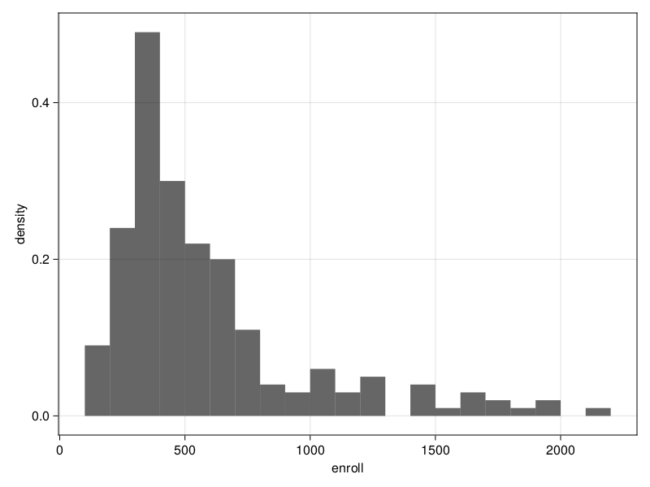

## Instalation

The `Survey.jl` package is not yet registered. For now, installation of the package
is done using the following command:

```julia
]  add "https://github.com/xKDR/Survey.jl.git"
```

After registration, the regular `Pkg` commands can be used for installing the package:

```@repl
using Pkg

Pkg.add("Survey")
```

```julia
]  add Survey
```

## Tutorial

This tutorial assumes basic knowledge of statistics and survey analysis.

To begin this tutorial, load the package in your workspace:

```@repl tutorial
using Survey
```

Now load a survey dataset that you want to study. In this tutorial we will be using
the [Academic Performance Index](https://r-survey.r-forge.r-project.org/survey/html/api.html)
(API) datasets for Californian schools. The datasets contain information for all
schools with at least 100 students and for various probability samples of the
data.

!!! note

    The API program has been discontinued at the end of 2018. Information is archived
    at [https://www.cde.ca.gov/re/pr/api.asp](https://www.cde.ca.gov/re/pr/api.asp)

```@repl tutorial
apisrs = load_data("apisrs")
```

`apisrs` is a simple random sample of the Academic Performance Index of Californian
schools. The [`load_data`](@ref) function loads it as a
[`DataFrame`](https://dataframes.juliadata.org/stable/lib/types/#DataFrames.DataFrame).
You can look at the column names of `apisrs` to get an idea of what the dataset
contains.

```@repl tutorial
names(apisrs)
```

Next, build a survey design from your `DataFrame`:

```@repl tutorial
srs = SurveyDesign(apisrs; weights=:pw)
```

This is a simple random sample design with weights given by the column `:pw` of
`apisrs`. You can also create more complex designs such as stratified or cluster
sample designs. You can find more information on the complete capabilities of
the package in the [Manual](@ref). The purpose of this tutorial is to show the
basic usage of the package. For that, we will stick with a simple random sample.

Now you can analyse your design according to your needs using the
[functionality](@ref Index) provided by the package. For example, you can compute
the estimated mean or population total for a given variable. Let's say we're
interested in the mean Academic Performance Index from the year 1999. First we
need to convert the [`SurveyDesign`](@ref) to a [`ReplicateDesign`](@ref) using
bootstrapping:

```@repl tutorial
bsrs = bootweights(srs)
```

We do this because [TODO: explain why]. Now we can compute the estimated mean:

```@repl tutorial
mean(:api99, bsrs)
```

We can also find the mean of both the 1999 API and 2000 API for a clear
comparison between students' performance from one year to another:

```@repl tutorial
mean([:api99, :api00], bsrs)
```

The [`ratio`](@ref) is also appropriate for studying the relationship between
the two APIs:

```@repl tutorial
ratio(:api00, :api99, bsrs)
```

If we're interested in a certain statistic estimated by a specific domain, we
can add the domain as the second parameter to our function. Let's say we want
to find the estimated total number of students enrolled in schools from each
county:

```@repl tutorial
total(:enroll, :cname, bsrs)
```

Another way to visualize data is through graphs. We can make a histogram to
better see the distribution of enrolled students:

```@setup warning
# !!!THIS NEEDS TO MATCH THE EXAMPLE IN THE DOCSTRING OF `hist`
```

```julia
julia> hist(srs, :enroll)
```

The REPL doesn't show the plot. To see it, you need to save it locally.

```julia
julia> import AlgebraOfGraphics.save

julia> save("hist.png", h)
```


